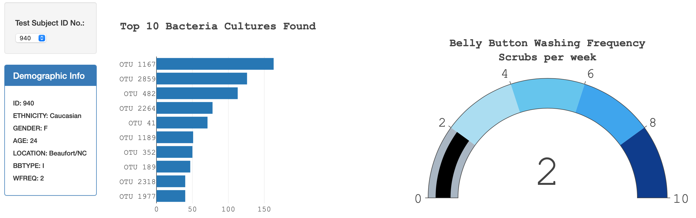

Your belly button is the leftover remnant of what was once the umbilical cord, the rope-like connection between you and your mother that supplied all of your nutrients and oxygen when you were in the womb. When you were born, the doctor (or maybe even your shaky-handed father) cut the umbilical cord a couple of inches away from your belly and clamped off the remaining section.

According to a delightfully odd scientific initiative called the Belly Button Diversity project, belly buttons are home to a startling diversity of bacteria. The fun started back in 2011 at North Carolina State University, when a team of young researchers got the idea to explore the microbiome of the belly button. Would the bacteria colonies in the navel be different than those found on the rest of the body? 

Using RNA sequencing, the researchers identified 2,368 different species of bacteria living in the navels of 60 volunteers. For reference, there are half as many species of birds or ants in North America. 

Although eight species of bacteria dominated the belly button microbiome, accounting for 45 percent of the total population, there was still incredible diversity among individuals. For example, no single bacteria were found in every belly button, and 2,188 of the species were only found in 10 percent of sampled belly buttons. 

One dude (and we're assuming it was a dude) not only carried loads of bacteria in his belly button, but also two species of archaea, "a domain of life often found in extreme environments and not previously reported from human skin," wrote the researchers, adding that the individual "self-reported not having showered or bathed for several years." 

(Above text is taken from health.howstuffworks. If you are interested in, you can visit the webpage for more info. https://health.howstuffworks.com/human-body/parts/5-things-didnt-know-about-belly-button.htm )

Below is our research sample data and its visual display with different types of charts.